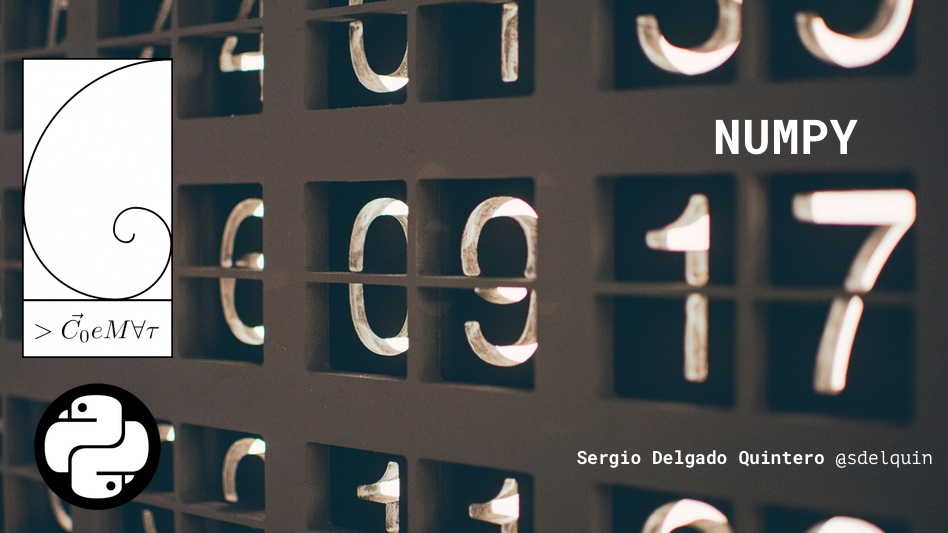

Presentación sobre [NumPy](http://www.numpy.org/) para el [COEMAT 2019](http://damatull.webs.ull.es/). Se puede [ver online con nbviewer](https://nbviewer.jupyter.org/github/sdelquin/python-talks/blob/master/numpy/numpy.ipynb).

